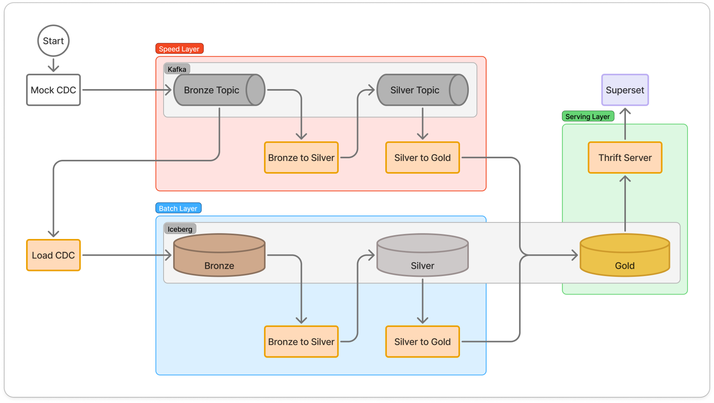

## 프로젝트 개요

- 목표: 실시간 배송 지연 모니터링 및 매출 대시보드 구축
- 기간: 2025년 4월 ~
- 사용 기술: kafka, confluent, spark, iceberg, minio, airflow, prometheus, grafana, superset
- 사용 데이터: [Brazilian E-Commerce Public Dataset by Olist](https://www.kaggle.com/datasets/olistbr/brazilian-ecommerce/data)
    - 브라질 소상공인들에게 온라인 마켓플레이스를 제공하는 전자상거래 플랫폼인 `Olist`에서 제공한 캐글 데이터

## 프로젝트 목표 선정 배경

### 비즈니스 모델 분석
- Olist는 오픈 마켓 특성상 판매 중개 수수료(Commission)가 핵심 수익원입니다.
- 따라서 **판매자의 매출 성장이 곧 플랫폼(Olist)의 매출 확대로 직결되는 '동반 성장 구조'**를 가지고 있습니다.

### 가설 설정 및 목표
- 이에 따라 **'매출 증대'**를 최우선 비즈니스 목표로 가정하였습니다.
- 이 후, 데이터를 통해 그 **성장 동력(Growth Driver)**을 발굴하고자 EDA를 수행했습니다.

### EDA
- `Olist` 플랫폼의 매출 성장을 저해하는 원인을 파악하기 위해, 리뷰에 대한 텍스트 마이닝(EDA)을 수행했습니다.

#### 번역 추론
- 모델 선정
    - 번역 특화 LLM인 [Unbabel/TowerInstruct-7B-v0.2](https://huggingface.co/Unbabel/TowerInstruct-7B-v0.2)를 채택 했습니다.

- 추론 환경
    - CPU
        - Model: Intel Core i5-12600K (12th Gen)
        - Cores: 10 cores / 16 threads
        - Max Clock: 4.9 GHz

    - GPU
        - Model: NVIDIA GeForce RTX 3060
        - VRAM: 12GB
        - CUDA Version: 12.2
        - Driver Version: 535.274.02

- 수행 결과
    - 총 36,455건의 리뷰 데이터를 약 7일에 걸쳐 번역 완료 ([이슈사항](https://github.com/jmhwang-dev/e-commerce/issues?q=is%3Aissue%20state%3Aclosed))
    - 가용 자원을 최대로 사용하기 위한 [추론 패키지 개발](https://github.com/jmhwang-dev/e-commerce/tree/develop/src/translate)
        - [멀티 프로세싱 (Multi-processing)](https://github.com/jmhwang-dev/e-commerce/blob/develop/scripts/inference/run_por2eng.py)
        - [동적 배칭 (Dynamic Batching)](https://github.com/jmhwang-dev/e-commerce/blob/develop/src/translate/inference/translate.py#L40)
        - [번역 추론 관련 config 정의](https://github.com/jmhwang-dev/e-commerce/blob/develop/src/translate/utils/config.py)
            ```yaml
            # example

            src_path: ~/github/jmhwang-dev/e-commerce/data/silver/clean_comments_text_only.tsv
            dataset_start_index: 0
            dataset_end_index: 18227
            dst_path: ~/jmhwang-dev/e-commerce/artifacts/inference/por2eng_20250626_172543_1.tsv
            checkpoint: Unbabel/TowerInstruct-7B-v0.2
            device: auto
            initial_batch_size: 30
            language_from: Portuguese
            language_into: English

            ```

#### 리뷰 분석
- 부정 리뷰 (리뷰 점수가 1~2점)
    - 상위 20개 키워드 중 `deliver`, `receive`, `didnt`, `wait` 등 **배송 관련 키워드가 60% 이상**을 차지함을 확인했습니다.
    
    _review_low_score_

- 긍정 리뷰 (리뷰 점수가 4~5점)
    - 긍정 리뷰에서도 배송 관련 키워드의 언급이 있었으나, 부정 리뷰 대비 `fast`라는 키워드가 존재했습니다. 
    
    _review_high_score_

- 실제 데이터에서 리뷰 스코어의 그룹별 배송 지연 여부의 비율이 차이가 있었습니다.
    
    _late_delivery_rate_

- 위 결과를 통해 **배송 문제**가 핵심 상품의 매출 성장을 저해하는 주요 원인 중 하나임을 도출하였습니다.

## 상품 포트폴리오 매트릭스
### 도입 배경
- 한정된 자원으로 모든 제품의 배송 지연을 관리하는 것은 운영 효율이 낮다는 문제점이 있습니다.
- 단순히 배송 지연 현황을 나열하기 보다 비즈니스 영향력이 더 큰 제품에 대한 관리가 더 효율적입니다.
- 따라서, `어떤 제품의 배송 지연이 비즈니스에 더 치명적인가?`를 판단할 수 있는 기준이 필요했습니다.
- BCG 매트릭스 제품의 비즈니스 영향력을 평가하는 대표적인 방법입니다.

    > BCG 매트릭스(BCG Matrix)
    - 정의: 보스턴 컨설팅 그룹(Boston Consulting Group)이 개발한 전략 평가 도구
    - 목적: 자원을 어떻게 배분할지 결정할 때 사용
    - 방법: 기업이 보유한 여러 사업이나 제품을 `시장 성장률`과 `상대적 시장 점유율` 두 가지 축을 기준으로 분류

- BCG 매트릭스를 산출하려면 다음과 같은 지표가 필요합니다.
    - 시장 점유율 (Relative Market Share)
    - 시장 성장률 (Market Growth Rate)

- 그러나, `Olist` 데이터셋은 내부 트랜잭션 데이터이므로 이를 구할 수 없었습니다.
- 제품의 비즈니스 영향력을 평가하기 위해, BCG 매트릭스를 기반으로 `상품 포트폴리오 매트릭스`를 재정의했습니다.

### 정의 과정
#### 통계적 타당성 확보 (Independence of Variables)
- 단순히 내부 데이터를 쓴다고 해결되는 게 아니라, 축(Axis) 설정에 신중해야 했습니다.
- 초기에는 Y축을 '매출(Revenue)'로 잡았으나, 다중공선성 문제가 있었습니다.
    - 문제: 매출 = 판매량 × 단가이므로, 판매량(X축)이 늘면 매출(Y축)도 같이 늘어나는 강한 상관관계가 발생합니다.
    - 해결: 매출에 대한 독립 변수인 **판매량**과 **평균 단가(Unit Price)**를 Y축으로 채택하여, **"많이 팔리는가(Traffic)"**와 **"비싸게 팔리는가(Value)"**라는 서로 다른 두 가지 가치를 명확히 구분했습니다.

    
_corr_heatmap_top16_

    
_corr_scatter_with_reg_top_16_

#### 통계적 보정: 롱테일 분포 해결
* **현상 분석:** 데이터 분석 결과, 전체 상품군 별 **50% 이상이 '월 판매량 1개'**에 집중된 심한 롱테일(Long-tail) 분포를 보였습니다.
* **보정 적용:** 중앙값을 그대로 적용할 경우 변별력이 상실되는 문제를 해결하기 위해, **성과 기준을 중앙값 초과(>1)로 상향 조정**하여 유의미한 4분면 분류를 도출했습니다.

_long_tail_quantity_by_product_

#### 최종 분류 및 의미
- 최종적으로 상품 포트폴리오 매트릭스는 아래와 같습니다.
    * **X축 (인기도) - 판매량 (Sales Quantity)**
        - 시장 점유율을 대체하는 지표
        - 해당 상품이 플랫폼 내에서 점유하고 있는 트래픽과 수요의 규모를 측정
    * **Y축 (기여도) - 평균 단가 (Mean Price)**
        - 시장 성장률을 대체하는 지표
        - 해당 상품이 비즈니스 수익 창출에 실질적으로 얼마나 기여하는지를 측정

- 카테고리 내 상대적 위치를 파악하기 위해 각 축의 **중앙값(Median)**을 기준으로 4분면(Quadrant)을 구분하였으며, 상품군은 다음과 같이 분류됩니다.
    * **Star Products (High Vol, High Rev):** 높은 인기와 매출을 모두 견인하는 **핵심 상품**
    * **Volume Drivers (High Vol, Low Rev):** 객단가는 낮으나 압도적인 판매량으로 **트래픽을 유입시키는 상품**
    * **Niche Gems (Low Vol, High Rev):** 판매량은 적으나 고단가로 **높은 마진을 창출하는 틈새 상품**
    * **Question Marks (Low Vol, Low Rev):** 성과가 저조하여 판매 중단 혹은 **전략 수정이 필요한 상품**

    
        _example: product_portfolio_matrix for health_beauty_

## 데이터 준비

### CDC (Change Data Capture)
- 원본 데이터의 RDBMS 구조를 아래와 같은 이유로 스키마를 재설계 했습니다.
    - 시계열성이 없음: 레코드가 덮어쓰여지는 경우가 존재하여 변경 이력을 추적할 수 없는 경우가 존재
    
- 이를 위해 원본 데이터를 [전처리](https://github.com/jmhwang-dev/e-commerce/tree/develop/scripts/olist_redefined)하여 스트리밍을 모방했습니다. 내용은 아래와 같습니다.
    - 원본 데이터 스키마의 무결성에 위배되는 중복 레코드 통합 및 불필요한 열 삭제
    - 원본 데이터 스키마에서 비효율을 개선한 최소한의 스키마 변경
- 생성된 `tsv` 파일의 이름은 총 9개로, CDC에서 아래 요소들을 정의할 때 사용됩니다.
    - `Bronze Layer`의 테이블 이름
    - `Bronze Topic`의 토픽 이름
- `테이블 변경 전 후` 변경 내용과 `CDC에 사용할 데이터의 최종 스키마`를 도식화하면 아래와 같습니다.


_테이블 변경 전 후_


_CDC에 사용할 데이터의 최종 스키마_

### 데이터 주입 시간 추가
- 스트림 데이터를 모방하기 위해 `current_ingest_time` 열을 추가하여 데이터 주입 시간을 관리합니다.
- 원래는 메시지 소비 시점에 `current_ingest_time`을 추가해야 합니다.
- 그러나 개발 편의성을 위해 메시지 발행 단계에서 주입 시간을 추가하도록 [PandasProducer](https://github.com/jmhwang-dev/e-commerce/blob/develop/src/service/producer/base/pandas.py) 클래스를 구현했습니다.
- `current_ingest_time`은 아래와 같이 계산합니다.

```python
"""current_ingest_time 계산"""

current_ingest_time = \
    `order_status.tsv`의 이벤트 발생 시간 + \
    pd.Timedelta(f"{50 + np.random.rand() * 50}ms") # 임의의 네트워크 지연 시간: [50ms, 100ms)
```
- 이 때, `FK`로 연결된 모든 레코드에도 직전 계산된 `current_ingest_time`에 지연시간을 추가하여 레코드의 시계열성을 보장합니다.

### 메시지 발행 간격 설정: 휴지기(Idle Time) 단축 전략

#### 배경 및 목적
- 원본 데이터(`olist_orders`)에서 주문상태는 **수 시간에서 수일 간격**으로 발생하는 경우가 포함되어 있습니다.
- 이를 실시간 파이프라인 시뮬레이션에 그대로 적용할 경우, **데이터가 유입되지 않는 긴 대기 시간**으로 인해 개발 효율성이 저하됩니다.
- 따라서 **실제 주문 패턴(Burstiness)은 유지하되, 불필요한 공백기만 효율적으로 단축**하는 전략을 수립하였습니다.

#### 데이터 분포 분석
- 전체 주문 데이터에서 [주문 상태의 시간 차이](https://github.com/jmhwang-dev/e-commerce/blob/develop/notebooks/pandas/eda/diff_event_timestamp.ipynb)를 분석한 결과는 다음과 같습니다.

    * **Median (50%):** 39초 (평균적인 주문 흐름)
    * **75th Percentile:** 120초 (2분)
    * **90th Percentile:** 286초 (약 4분 46초)

- 위 결과로부터 전체 주문 간격의 **90%는 약 5분(300초) 이내**에 발생함을 확인할 수 있었습니다.

#### 임계값 설정

- 현실성 있는 [메시지 발행 시뮬레이션](https://github.com/jmhwang-dev/e-commerce/blob/develop/simulator/run.py)과 개발 속도를 높이기 위해 다음과 같이 임계값을 설정하였습니다.

    - **Threshold: `300초` (5분)**
        - 전체 데이터 패턴의 **90%를 원본 그대로 보존**
        - 주문 폭주(Burst) 및 일반적인 트래픽 리듬을 왜곡 없이 재현
    - **Base Interval: `30초`**
        - Grafana에서 **트래픽이 끊겼음(Lag 해소)**을 시각적으로 인지할 수 있는 최소한의 대기 시간 확보

```python
"""transaction replay: mock real-time transaction"""

base_interval = 30  # seconds
threshold_interval = 300  # seconds

order_status_df = OrderStatusBronzeProducer.get_df()
past_event_timestamp = pd.to_datetime("2016-09-04 21:15:19.000000")   # first timestamp in order_status
for i, order_status_series in order_status_df.iterrows():
    current_event_timestamp = order_status_series['timestamp']
    event_term = current_event_timestamp - past_event_timestamp

    # transaction replay: mock real-time transaction
    if event_term > pd.Timedelta(seconds=threshold_interval):
        time.sleep(base_interval)
    else:
        time.sleep(event_term.total_seconds())
```


## 파이프라인 구조: 하이브리드(Hybrid) 모니터링 시스템

- 프로젝트 목표로부터 아키텍처의 기본 요구사항은 아래와 같습니다.
    1. 배송지연 모니터링을 위한 주문 상태 시간의 스트림 처리 필요
    2. 상품 포트폴리오 매트릭스를 계산하기 위한 `평균 판매액`과 `주문 수` 배치 집계 필요

- 요구사항을 통해 파이프라인 아키텍처를 다음과 같이 설계했습니다.
    * **Analytical Layer (Batch):** 대용량 판매 이력을 분석하여 상품별 **비즈니스 등급(Tier)**을 산정
    * **Operational Layer (Streaming):** 개별 주문의 배송 상태와 지연 여부를 **실시간으로 추적**
    * **Serving Layer (Hybrid):** 위 두 정보를 결합하여, 운영자가 **핵심 상품(Star Product)의 지연**을 최우선으로 식별하고 조치할 수 있도록 지원


_Lambda Architecture_

### Ingestion Layer

#### Confluent Schema Registry
- CDC로 원천 데이터의 정합성을 보장하기 위해 도입했습니다.
- 원천 데이터는 누락이 없이 수집되어야 하므로 [메시지에 null 값이 포함돼도 발행되도록 스키마를 구성](https://github.com/jmhwang-dev/e-commerce/tree/develop/infra/confluent/schemas/bronze)하였습니다.
- 메시지 발행 시, schema registry에 등록한 Avro schema를 통해 직렬화를 수행합니다.

<!-- 
- 키 추가 내용
- 코드 스니펫?
-->

#### Kafka cluster
- 프로젝트 목표 중 `실시간 배송 지연 모니터링` 달성을 위해 Kafka를 사용했습니다.
- Kafka cluster는 최소 3개의 노드로 구성해야 장애 대응에 안정적이므로 3개의 노드로 구성했습니다.
- 전통적으로 많이 사용되던 메타데이터 관리 방식인 ZooKeeper가 deprecated 될 예정이었으므로, KRaft 모드로 구성했습니다.
<!-- - 단일 파티션에서는 모든 메시지가 한 파티션에 저장되므로, 메시지의 순서가 보장됩니다.
- 파티션 개수는 메시지의 시간 순서를 보장하고 구현을 단순화하기 위해 단일 파티션으로 구성하였습니다. -->
- 데이터 주입 시, 개발 및 운영을 상황을 고려해서 동일 네트워크 및 외부 클라이언트가 주입할 수 있도록 [advertised.listeners](https://github.com/jmhwang-dev/e-commerce/blob/develop/configs/kafka/server1.properties)를 구성하였습니다.

### Speed Layer

#### Spark Streaming
- 배치 처리와 스트림 처리를 모두 지원하는 통합 프레임워크로서 Spark를 선택했습니다.
- Spark 클러스터를 구축하여 대용량 데이터 처리의 성능과 확장성을 확보했습니다.
- 구성은 클라이언트 노드, 마스터 노드, 워커 노드로 각각 하나의 컨테이너로 배포하였습니다.<br>[스파크 클러스터 설정](https://github.com/jmhwang-dev/e-commerce/blob/develop/configs/spark/spark-defaults.conf))

### Batch Layer
#### Spark Batch & Airflow


_dag diagram_
<!-- ### Airflow -->

### Storage (MinIO)


_medallion architecture_

#### Iceberg
- 테이블 형식은 Iceberg을 선정하였고 이유는 다음과 같습니다.
    - 스키마와 파티션의 자유로운 변경: 현재는 CDC 데이터의 스키마가 고정되어 있지만, 추후 스키마가 변경될 수 있는 가능성을 내재하고 있음
    - ACID 트랜잭션 보장:  여러 데이터 작업이 동시에 테이블에 접근하더라도 데이터 정합성이 깨지지 않으며, 커밋(Commit)이 완료된 작업만 사용자에게 보여주어 데이터의 신뢰도를 보장
    - 다양한 엔진과의 호환성 및 개방성: 엔진에 종속되지 않는 개방형 표준을 지향
    - 시간 여행과 버전 롤백: 특정 시점의 스냅샷 ID나 타임스탬프를 지정하여 과거의 데이터를 조회 가능하고, 데이터 처리 작업에 오류가 발생했을 경우, 이전의 특정 스냅샷으로 되돌릴 수 있어 데이터 안정성을 크게 높여줌

- 데이터 저장소로 MinIO를 사용하였습니다.
    - 비용과 보안 이슈에 상대적으로 자유로운 on-premise 상황을 가정했습니다.
    - 추후 클라우드로 이전할 수 있는 상황을 고려하여 s3 object storage의 api와 동일한 MinIO를 채택하였습니다.
- MinIO에 저장되는 데이터는 Medallion Layer 구조를 기반으로 데이터 처리와 목적에 따라 Bronze, Silver, Gold 레이어로 분류하여 적재합니다.


<!-- #### Bronze 레이어

| 테이블 이름                | 설명                              |
|----------------------------|-----------------------------------|
| `order_item`               | 주문 품목 정보 저장              |
| `order_status`             | 주문 상태 및 타임스탬프 저장     |
| `estimated_delivery_date`  | 예상 배송일 저장                 |
| `product`                  | 제품 정보 저장                   |
| `payment`                  | 결제 정보 저장                   |
| `customer`                 | 고객 정보 저장                   |
| `geolocation`              | 위치 정보 저장                   |
| `seller`                   | 판매자 정보 저장                 |
| `review`                   | 리뷰 정보 저장                   |

#### Silver 레이어

| 테이블 이름                    | 설명                              |
|--------------------------------|-----------------------------------|
| `order_product`               | 주문과 제품을 조인한 결과            |
| `delivered_order_product`     | 배송 완료된 제품 정보         |
| `user_location`               | 고객/판매자 위치 정보 통합       |
| `delivered_order_timestamp`   | 배송 완료 주문의 통합 시간 기록   |
| `order_timestamp`             | 주문 상태 별 시간 기록          |

#### Gold 레이어

| 테이블 이름                        | 설명                              |
|------------------------------------|-----------------------------------|
| `timestamp_stats_wide`            | 배송 리드타임 통계                |
| `sale_stats`                      | 제품별 매출 집계                 |
| `health_beauty_sales_stats_bcg`   | Health & Beauty 매출 및 BCG 세그먼트 |
| `delivered_order_product_bcg`     | 배송 완료 제품에 BCG 세그먼트 추가 |
| `order_location`                  | 주문의 고객/판매자 위치 정보     |
| `review_metadata_product`        | Health & Beauty 리뷰 정보         | -->

### Serving Layer
#### Thrift Server

#### Superset
- Superset을 활용하여 `매출 집계` 및 `실시간 배송지연 모니터링`을 확인할 수 있도록 인터랙티브하게 구성했습니다.
    - `Sales Detail`
        - Rank by Category: 제품군 별 누적 매출 순위
        - Rank by Product: 제품 별 누적 매출 순위
        - Sales Quantity by Month: 월 별 판매 제품 개수
        - Sales by Month: 월 별 매출 (제품군별, 제품별 확인 가능)
        - Review Distribution: 매출 기준 4개 그룹의 리뷰 점수 분포
        - Average Order Lead Days by Month: 월별 평균 배송 단계 소요 시간

    - `Delivery Monitor`
        - Delivery Status: 주문 상태별 타임스탬프와 배송사의 배송 소요일
        - Order Detail: 주문 상세 (카테고리, 제품, 수량, 단가)
        - Order Location: 주문 제품의 판매자와 구매자의 위치

## 결과


