## 프로젝트 개요

- 목표: 실시간 배송 지연 모니터링 및 매출 대시보드 구축
- 기간: 2025년 4월 ~
- 사용 데이터: [Brazilian E-Commerce Public Dataset by Olist](https://www.kaggle.com/datasets/olistbr/brazilian-ecommerce/data)
    - 브라질 소상공인들에게 온라인 마켓플레이스를 제공하는 전자상거래 플랫폼인 Olist에서 제공한 캐글 데이터
- 사용 기술 및 버전
    - Kafka: `3.9.1`
    - Confluent: `7.6.1`
    - Spark: `3.5.6`
    - Iceberg: `1.9.1`
    - MinIO: `RELEASE.2025-06-13T11-33-47Z`
    - Airflow: `3.0.6`
    - Prometheus: `3.5.0`
    - Grafana: `12.2.0`
    - Superset: `5.0.0`

## 프로젝트 목표 선정 배경

### 비즈니스 모델 분석
- Olist는 오픈 마켓 특성상 판매 중개 수수료가 핵심 수익원입니다.
- 따라서 **판매자의 매출 성장이 곧 플랫폼(Olist)의 매출 확대로 직결되는 동반 성장 구조**를 가지고 있습니다.

### 가설 설정 및 목표
- 이에 따라 **'매출 증대'**를 최우선 비즈니스 목표로 가정하였습니다.
- 이후, 데이터를 통해 그 **성장 동력**을 발굴하고자 EDA를 수행했습니다.

### EDA
- Olist 플랫폼의 매출 성장을 저해하는 원인을 파악하기 위해, 리뷰에 대한 텍스트 마이닝(EDA)을 수행했습니다.
- 리뷰는 포르투갈어로 작성되어 있었기 때문에 이를 번역하는 작업을 먼저 수행했습니다.

#### 번역 추론
- 모델 선정
    - 번역 특화 LLM인 [Unbabel/TowerInstruct-7B-v0.2](https://huggingface.co/Unbabel/TowerInstruct-7B-v0.2)를 채택했습니다.

- 추론 환경
    - CPU
        - Model: Intel Core i5-12600K (12th Gen)
        - Cores: 10 cores / 16 threads
        - Max Clock: 4.9 GHz

    - GPU
        - Model: NVIDIA GeForce RTX 3060
        - VRAM: 12GB
        - CUDA Version: 12.2
        - Driver Version: 535.274.02

- 수행 결과
    - 총 36,455건의 리뷰 데이터를 약 7일에 걸쳐 번역 완료 ([이슈사항](https://github.com/jmhwang-dev/e-commerce/issues?q=is%3Aissue%20state%3Aclosed))
    - 가용 자원을 최대로 사용하기 위한 [추론 패키지 개발](https://github.com/jmhwang-dev/e-commerce/tree/develop/src/translate)
        - [멀티 프로세싱 (Multi-processing)](https://github.com/jmhwang-dev/e-commerce/blob/develop/scripts/inference/run_por2eng.py)
        - [동적 배칭 (Dynamic Batching)](https://github.com/jmhwang-dev/e-commerce/blob/develop/src/translate/inference/translate.py#L40)
        - [번역 추론 관련 config 정의](https://github.com/jmhwang-dev/e-commerce/blob/develop/src/translate/utils/config.py)
            ```yaml
            # example

            src_path: ~/github/jmhwang-dev/e-commerce/data/silver/clean_comments_text_only.tsv
            dataset_start_index: 0
            dataset_end_index: 18227
            dst_path: ~/jmhwang-dev/e-commerce/artifacts/inference/por2eng_20250626_172543_1.tsv
            checkpoint: Unbabel/TowerInstruct-7B-v0.2
            device: auto
            initial_batch_size: 30
            language_from: Portuguese
            language_into: English

            ```

#### 리뷰 분석
- 부정 리뷰 (리뷰 점수가 1~2점)
    - 상위 20개 키워드 중 `deliver`, `receive`, `wait` 등 **배송 관련 키워드가 60% 이상**을 차지함을 확인했습니다.
    - 이 중, `didnt`라는 키워드로 부정적인 의견이 있음을 확인했습니다.
    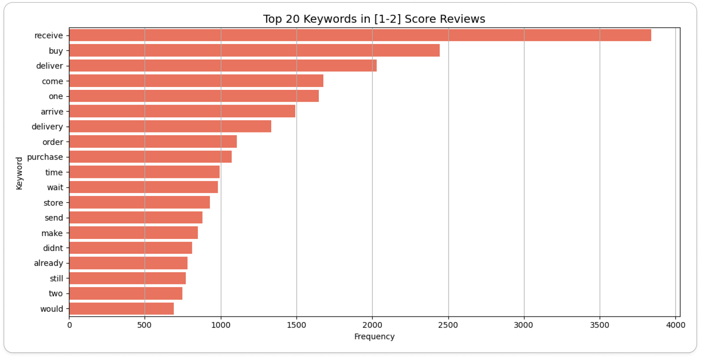
    _review_low_score_

- 긍정 리뷰 (리뷰 점수가 4~5점)
    - 긍정 리뷰에서도 배송 관련 키워드의 언급이 있었으나, 부정 리뷰 대비 `fast`라는 키워드가 존재했습니다.
    - 반면, 1~2점 대 리뷰 대비 부정적인 키워드가 상위에 존재하지 않았습니다.
    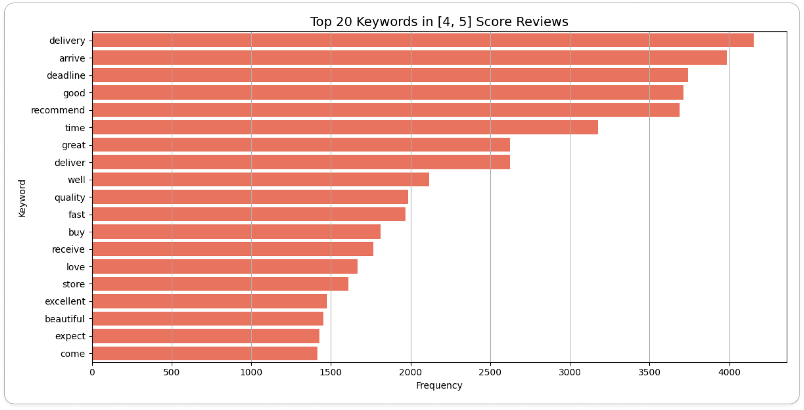
    _review_high_score_

- 실제 데이터에서 리뷰 스코어의 그룹별 배송 지연 여부의 비율에서 현저한 차이가 있었습니다.
    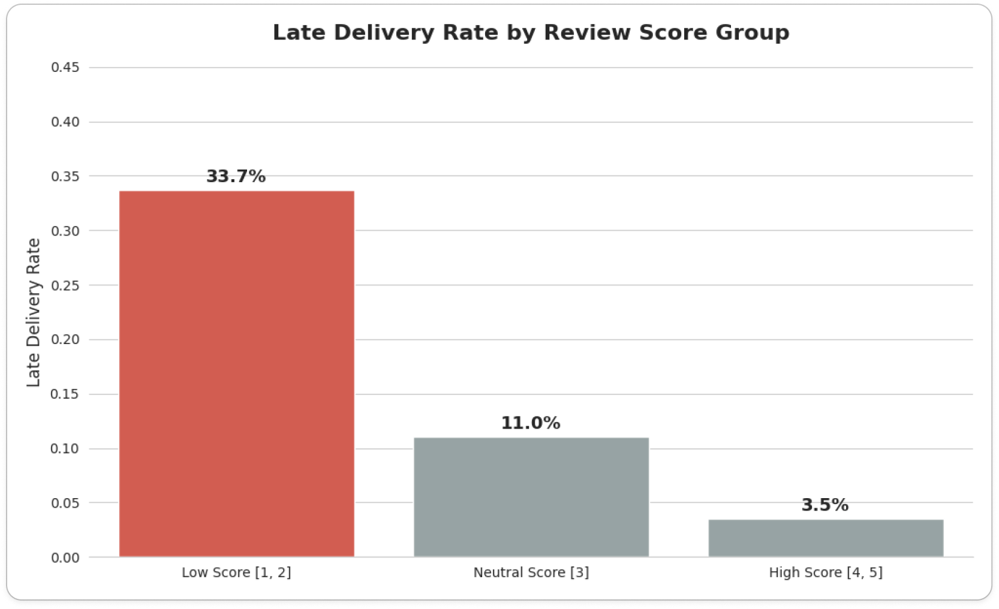
    _late_delivery_rate_

- 위 결과를 통해 **배송 문제**가 핵심 상품의 매출 성장을 저해하는 주요 원인 중 하나임을 도출하였습니다.

## 상품 포트폴리오 매트릭스
### 도입 배경
- 한정된 자원으로 모든 상품의 배송 지연을 관리하는 것은 운영 효율이 낮다는 문제점이 있습니다.
- 단순히 배송 지연 현황을 나열하기 보다 비즈니스 영향력이 더 큰 상품에 대한 관리가 더 효율적입니다.
- 따라서, `어떤 상품의 배송 지연이 비즈니스에 더 치명적인가?`를 판단할 수 있는 기준이 필요했습니다.
- BCG 매트릭스는 상품의 비즈니스 영향력을 평가하는 대표적인 방법입니다.

    > BCG 매트릭스(BCG Matrix)
    - 정의: 보스턴 컨설팅 그룹(Boston Consulting Group)이 개발한 전략 평가 도구
    - 목적: 자원을 어떻게 배분할지 결정할 때 사용
    - 방법: 기업이 보유한 여러 사업이나 상품을 '상대적 시장 점유율'과 '시장 성장률' 두 가지 축을 기준으로 분류

- BCG 매트릭스를 산출하려면 **상대적 시장 점유율**과 **시장 성장률** 지표가 필요합니다.
- 그러나, Olist 데이터셋은 내부 트랜잭션 데이터이므로 이를 구할 수 없었습니다.
- 상품의 비즈니스 영향력을 평가하기 위해, BCG 매트릭스를 기반으로 `상품 포트폴리오 매트릭스`를 재정의했습니다.

### 정의 과정
#### 통계적 타당성 확보
- 단순히 내부 데이터를 쓴다고 해결되는 게 아니라, 축 설정에 신중해야 했습니다.
- 초기에는 Y축을 매출로 잡았으나, 다중공선성 문제가 있었습니다.
    - 문제: 매출 = 판매량 × 단가이므로, 판매량(X축)이 늘면 매출(Y축)도 같이 늘어나는 강한 상관관계가 발생합니다.
    - 해결: 매출에 대한 독립 변수인 **판매량**과 **평균 단가**를 Y축으로 채택하여, **많이 팔리는가**와 **비싸게 팔리는가**라는 서로 다른 두 가지 가치를 명확히 구분했습니다.

    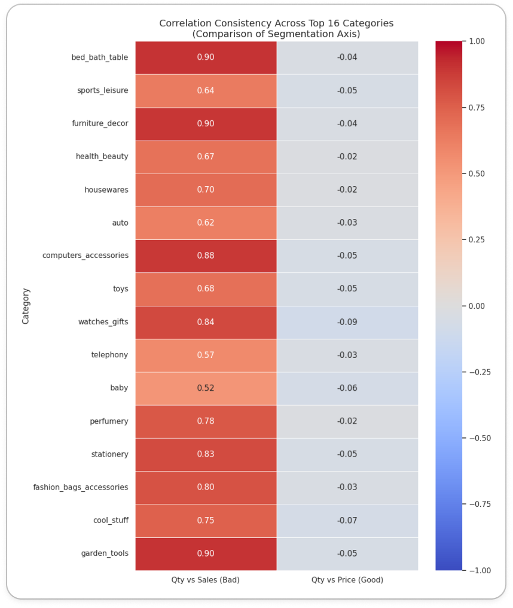
    _상위 16개 상품군의 상관관계 (heatmap)_

    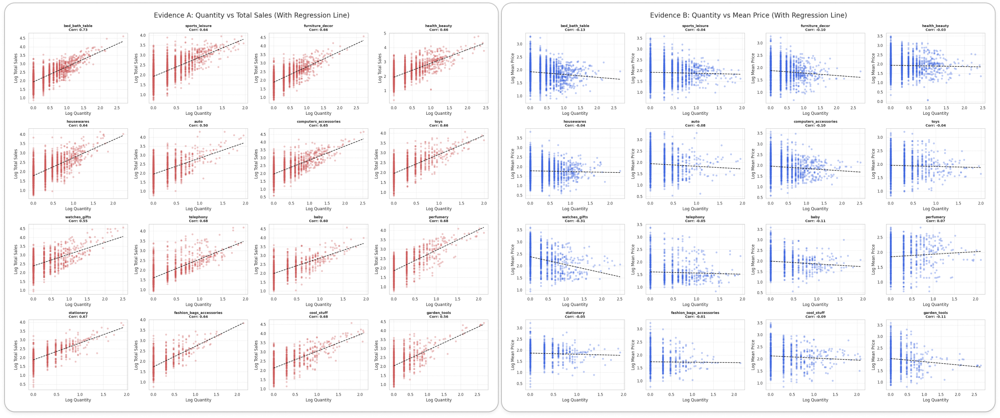
    _상위 16개 상품군의 상관관계 (scatter plot with regression)_

#### 통계적 보정: 롱테일 분포 해결
- **현상 분석:** EDA 결과, 전체 상품군 별 **50% 이상이 월 판매량 1개**에 집중된 롱테일 분포를 보였습니다.
- **보정 적용:** 중앙값을 그대로 적용할 경우 변별력이 상실되는 문제를 해결하기 위해, **성과 기준을 중앙값 초과(>1)로 상향 조정**하여 유의미한 4분면 분류를 도출했습니다.
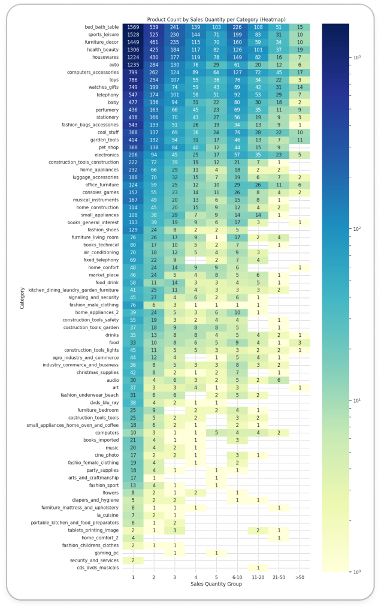
_long_tail_quantity_by_product_

#### 최종 분류 및 의미
- 최종적으로 상품 포트폴리오 매트릭스는 아래와 같습니다.
	- **X축 (인기도): 판매량**
        - 시장 점유율을 대체하는 지표
        - 해당 상품이 플랫폼 내에서 점유하고 있는 트래픽과 수요의 규모를 측정
	- **Y축 (기여도): 평균 단가**
        - 시장 성장률을 대체하는 지표
        - 해당 상품이 비즈니스 수익 창출에 실질적으로 얼마나 기여하는지를 측정

- 카테고리 내 상대적 위치를 파악하기 위해 각 축의 **중앙값**을 기준으로 4분면을 구분하였으며, 상품군은 다음과 같이 분류됩니다.
	- **Star Products (High Vol, High Rev):** 높은 인기와 매출을 모두 견인하는 **핵심 상품**
	- **Volume Drivers (High Vol, Low Rev):** 객단가는 낮으나 압도적인 판매량으로 **트래픽을 유입시키는 상품**
	- **Niche Gems (Low Vol, High Rev):** 판매량은 적으나 고단가로 **높은 마진을 창출하는 틈새 상품**
	- **Question Marks (Low Vol, Low Rev):** 성과가 저조하여 판매 중단 혹은 **전략 수정이 필요한 상품**

    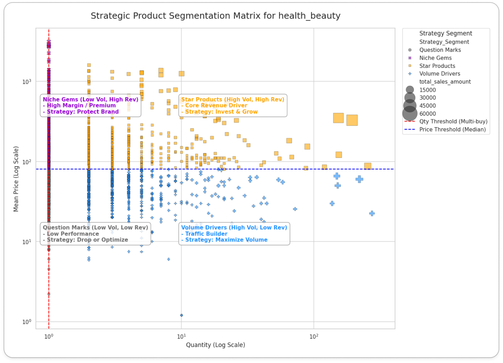
    _product_portfolio_matrix 예시: health_beauty 상품군_

## 데이터 준비

### 스키마 재설계
- 원본 데이터는 레코드가 덮어쓰여지는 구조로 인해 과거 이력을 추적할 수 없는 한계가 있었습니다.

- 이를 해결하고 CDC 기반의 파이프라인을 구축하기 위해 다음과 같이 데이터를 재설계 했습니다.
    - 변경 이력 추적 확보
        - 변경 사항을 감지할 수 있도록 append-only 구조로 변환
    - 데이터 품질 보장
        - 무결성을 저해하는 중복 레코드 제거 및 통합
        - 분석에 불필요한 열 제거 및 스키마 최적화
    
- 이를 위해 원본 데이터를 [전처리](https://github.com/jmhwang-dev/e-commerce/tree/develop/scripts/olist_redefined)하여 스트리밍을 모방했습니다.

- 생성된 `tsv` 파일의 이름은 총 9개로, CDC에서 아래 요소들을 정의할 때 사용됩니다.
    - **Bronze Layer**의 테이블 이름
    - **Bronze Topic**의 토픽 이름
- 테이블 변경 전 후 내용은 다음과 같습니다.

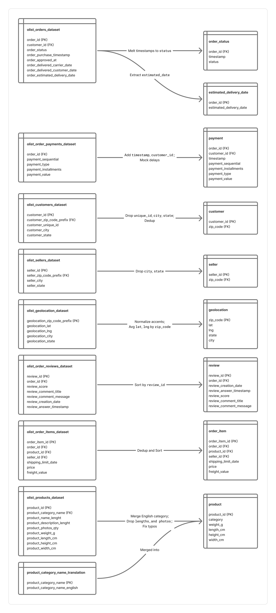
_테이블 변경 전 후_

### 데이터 주입 시간 추가
- 스트림 데이터를 모방하기 위해 `current_ingest_time` 열을 추가하여 데이터 주입 시간을 관리합니다.
- 원래는 메시지 소비 시점에 `current_ingest_time`을 추가해야 합니다.
- 그러나 개발 편의성을 위해 메시지 발행 단계에서 주입 시간을 추가하도록 [PandasProducer](https://github.com/jmhwang-dev/e-commerce/blob/develop/src/service/producer/base/pandas.py) 클래스를 구현했습니다.
- `current_ingest_time`은 아래와 같이 계산합니다.

```python
"""current_ingest_time 계산"""

current_ingest_time = \
    `order_status.tsv`의 이벤트 발생 시간 + \
    pd.Timedelta(f"{50 + np.random.rand() * 50}ms") # 임의의 네트워크 지연 시간: [50ms, 100ms)
```
- 이때, `FK`로 연결된 모든 레코드에도 직전 계산된 `current_ingest_time`에 지연시간을 추가하여 레코드의 시계열성을 보장합니다.

### 메시지 발행 간격 설정

#### 배경 및 목적
- 원본 데이터에서 주문상태는 수 시간에서 수일 간격으로 발생하는 경우가 포함되어 있습니다.
- 이를 메시지 발행에 그대로 적용할 경우, **데이터가 유입되지 않는 긴 대기 시간**으로 인해 개발 효율성이 저하됩니다.
- 따라서 **실제 주문 패턴은 유지하되, 불필요한 공백기만 효율적으로 단축**하는 전략을 수립하였습니다.

#### 주문 상태의 시간 차이 분석
- 전체 주문 데이터에서 [주문 상태의 시간 차이](https://github.com/jmhwang-dev/e-commerce/blob/develop/notebooks/pandas/eda/diff_event_timestamp.ipynb)를 분석한 결과는 다음과 같습니다.

	- **Median (50%):** 39초 (평균적인 주문 흐름)
	- **75th Percentile:** 120초 (2분)
	- **90th Percentile:** 286초 (약 4분 46초)

- 위 결과로부터 전체 주문 간격의 **90%는 약 5분(300초) 이내**에 발생함을 확인할 수 있었습니다.

#### 임계값 설정

- 현실성 있는 [메시지 발행 시뮬레이션](https://github.com/jmhwang-dev/e-commerce/blob/develop/simulator/run.py)과 개발 속도를 높이기 위해 다음과 같이 임계값을 설정하였습니다.

    - `threshold_interval`: 300초 (5분)
        - 전체 데이터 패턴의 **90%를 원본 그대로 보존**
        - 주문 폭주(Burst) 및 일반적인 트래픽 리듬을 왜곡 없이 재현
    - `base_interval`: 30초
        - Grafana에서 **트래픽이 끊겼음**을 시각적으로 인지할 수 있는 최소한의 대기 시간 확보

```python
"""transaction replay: mock real-time transaction"""

base_interval = 30  # seconds
threshold_interval = 300  # seconds

order_status_df = OrderStatusBronzeProducer.get_df()
past_event_timestamp = pd.to_datetime("2016-09-04 21:15:19.000000")   # first timestamp in order_status
for i, order_status_series in order_status_df.iterrows():
    current_event_timestamp = order_status_series['timestamp']
    event_term = current_event_timestamp - past_event_timestamp

    # transaction replay: mock real-time transaction
    if event_term > pd.Timedelta(seconds=threshold_interval):
        time.sleep(base_interval)
    else:
        time.sleep(event_term.total_seconds())
```

## 아키텍처 및 저장소 설계

### Lambda Architecture

- 본 프로젝트는 두 가지 요구사항을 동시에 충족해야 했습니다.

    1.  **실시간성:** 배송 지연과 같은 운영 이슈는 발생 즉시 감지하고 조치해야 하므로, 지연 없는 스트림 처리가 필수
    2.  **정확성 및 종합 분석:** 상품의 가치를 판단하기 위해, 축적된 대용량 판매 데이터 집계 필요

- 이를 위해, 배치 처리와 실시간 처리를 결합한 **Lambda Architecture**를 채택하여 파이프라인을 설계했습니다.


_Logical view: Lambda Architecture_

#### **Batch Layer**
- 전체 마스터 데이터를 기반으로 상품의 **장기적인 판매 성과(평균 판매액, 누적 주문 수)**를 주기적으로 분석합니다.
- 대용량 이력을 정밀하게 집계하여 상품별 **비즈니스 등급**을 산정하고, 이를 배치 뷰로 생성합니다.

#### **Speed Layer**
- 배치 주기가 도래하지 않은 **최근의 데이터**를 처리하여 배치 계층의 시간적 공백을 메웁니다.
- 개별 주문의 상태 변경을 실시간 스트림으로 수집하여, **현재 시점의 배송 상태와 지연 여부**를 즉각적으로 추적합니다.

#### **Serving Layer**
- 배치 뷰(상품 등급)와 실시간 뷰(현재 배송 상태)를 병합하여 사용자에게 제공합니다.
- 단순히 배송이 지연된다는 사실을 넘어, 중요 상품이 포함된 주문의 배송이 지연되고 있음을 식별합니다.
- 이를 통해 운영자가 우선순위에 따라 장애를 조치할 수 있도록 **실행 가능한 인사이트**를 제공합니다.

### Infrastructure

- 논리적 아키텍처의 구현은 **제한된 하드웨어 자원**의 효율적인 활용에 주안을 두었습니다.
- 특히, 이기종 하드웨어 간의 성능 차이를 극복하기 위해 다음과 같은 핵심 전략을 수립했습니다.
    - **제어의 중앙화**와 **연산의 분산**을 통해 시스템 안정성을 확보
    - **데이터 지역성 극대화**를 통해 핵심인 스트림 성능을 보장
- 하드웨어 자원과 인프라 설계를 도식화하면 다음과 같습니다.

| 장비명 | 수량 | CPU | Memory | 역할 |
| :--- | :--- | :--- | :--- | :--- |
| **iMac** | 1 | 6 Core | 32GB | Control Plane: 클러스터 관리 및 스케줄링
| **Desktop** | 1 | 16 Core | 32GB | Main Workload: 스트림 연산 및 데이터 웨어하우스 호스팅
| **Raspberry Pi 5** | 2 | 4 Core | 8GB | Batch Job: 실시간성이 낮은 배치 작업 격리 수행
| **Mini PC** | 1 | 4 Core | 16GB | Source: 단순 데이터 수집 및 전송 (Low Power)

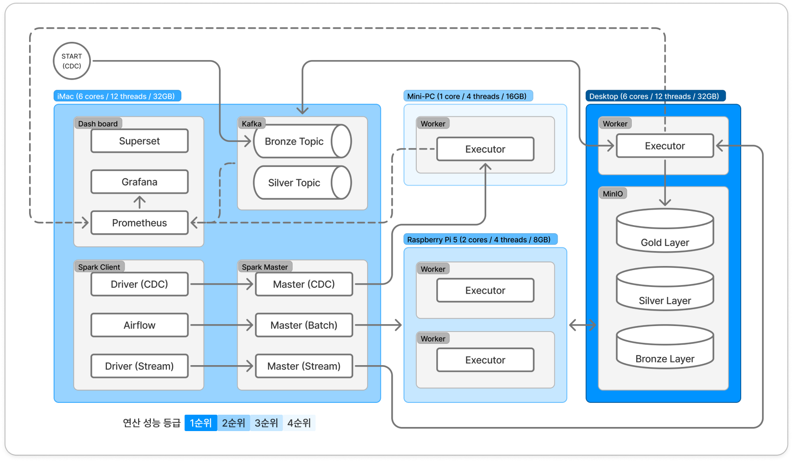
_Physical view: Infrastructure Architecture_


#### 제어 계층과 연산 계층의 물리적 분리
- **iMac**을 `Control Plane`로 정의하여 Kafka, Spark Master, Airflow 등 핵심 컴포넌트들을 집중 배치했습니다.
- 워커 노드에서 장애(OOM)가 발생하더라도, 제어 계층은 영향을 받지 않도록 보호하여 안정성을 높였습니다.

#### 실시간 스트림 처리 성능 최우선
- 클러스터 내 최고 성능인 **Desktop**에 Stream Executor와 MinIO 스토리지를 함께 배치했습니다.
- 비즈니스적으로 가장 중요한 실시간 파이프라인의 쓰기 작업이 네트워크를 경유하지 않고 **로컬 디스크 I/O**를 통해 수행되도록 하여, 처리 지연을 최소화하고 처리량을 극대화했습니다.

#### 배치 처리의 네트워크 오버헤드 수용 (Trade-off)
- 연산 리소스(Mini PC, 배치 처리)와 스토리지(Desktop, MinIO)를 물리적으로 분리하여, 단일 장비 부하를 방지하고 확장성을 고려했습니다.
- 물리적 분리로 인해 네트워크 트래픽(I/O) 비용이 발생하지만, 다음과 같은 이유로 채택했습니다.
    - **운영 복잡도를 낮추고 데이터 웨어하우스의 중앙 관리**를 실현
    - 배치 처리 속도가 소폭 저하되는 단점이 있으나, 실시간 스트림 처리 파이프라인의 안정성과 전체 시스템의 **데이터 정합성**을 최우선으로 확보

### Medallion Layer

#### Iceberg
- 테이블 형식은 Iceberg를 선정하였고 이유는 다음과 같습니다.
    - 스키마와 파티션의 자유로운 변경: 현재는 CDC 데이터의 스키마가 고정되어 있지만, 추후 스키마가 변경될 수 있는 가능성을 내재하고 있음
    - ACID 트랜잭션 보장:  여러 데이터 작업이 동시에 테이블에 접근하더라도 데이터 정합성이 깨지지 않으며, 커밋이 완료된 작업만 사용자에게 보여주어 데이터의 신뢰도를 보장
    - 다양한 엔진과의 호환성 및 개방성: 엔진에 종속되지 않는 개방형 표준을 지향
    - 시간 여행과 버전 롤백: 특정 시점의 스냅샷 ID나 타임스탬프를 지정하여 과거의 데이터를 조회 가능하고, 데이터 처리 작업에 오류가 발생했을 경우, 이전의 특정 스냅샷으로 되돌릴 수 있어 데이터 안정성을 크게 높여줌

#### MinIO
- 데이터 저장소로 MinIO를 사용하였습니다.
    - 비용과 보안 이슈에 상대적으로 자유로운 on-premise 상황을 가정했습니다.
    - 추후 클라우드로 이전할 수 있는 상황을 고려하여 S3 Object Storage의 API와 동일한 MinIO를 채택하였습니다.

#### 스키마 구조
- MinIO에 저장되는 데이터는 Medallion Layer 구조를 기반으로 데이터 처리 결과에 따라 다음과 같이 분류되어 적재됩니다.
    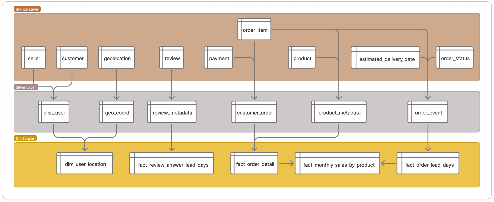
    _medallion architecture_

- Bronze Layer
    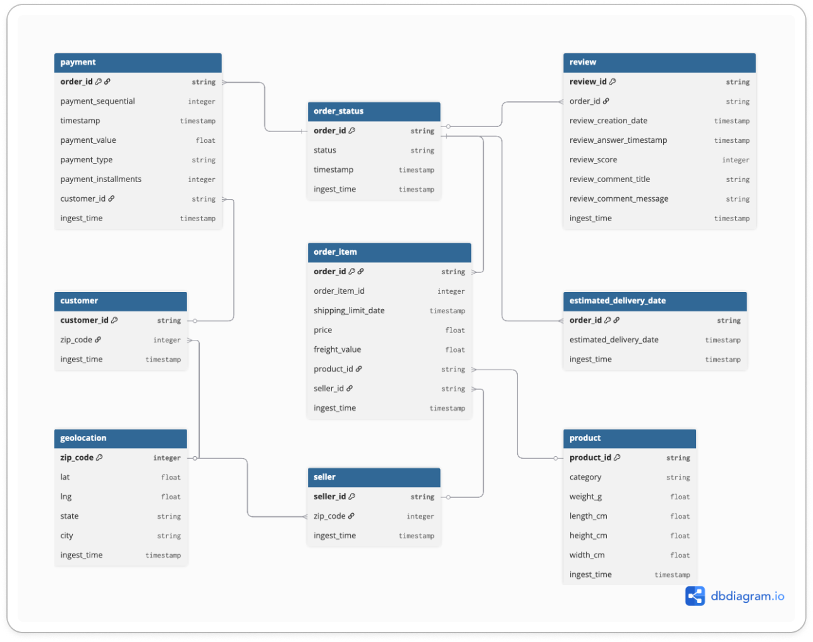
    _bronze_layer_schema_

    | 테이블 이름 | 설명 |
    |---|---|
    | `payment` | 주문 결제 수단 및 금액 정보 |
    | `customer` | 고객 ID 및 우편번호 정보 |
    | `geolocation` | 우편번호 기준 위도/경도 및 지역 정보 |
    | `order_status` | 주문 ID 별 현재 상태 및 타임스탬프 |
    | `order_item` | 주문에 포함된 상품 품목 및 배송비, 판매자 정보 |
    | `seller` | 판매자 ID 및 위치 정보 |
    | `product` | 상품 카테고리 및 규격(무게, 크기) 정보 |
    | `estimated_delivery_date` | 주문 별 예상 배송일 정보 |
    | `review` | 고객 리뷰 내용 및 평점, 작성 시간 |

- Silver Layer
    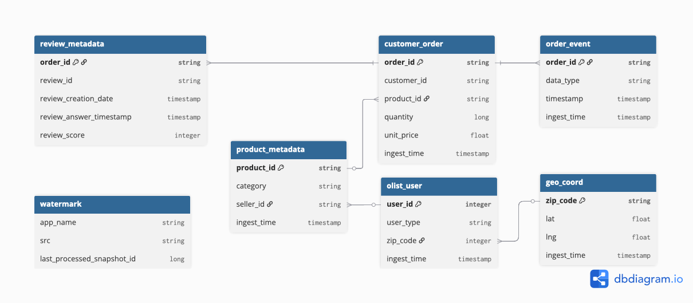
    _silver_layer_schema_

    | 테이블 이름 | 설명 |
    |---|---|
    | `review_metadata` | 리뷰 점수 및 작성/답변 시간 등 메타데이터 |
    | `customer_order` | 고객, 주문, 상품 정보를 결합한 트랜잭션 데이터 |
    | `product_metadata` | 상품 카테고리 및 판매자 연결 정보 |
    | `order_event` | 주문 처리 과정의 각종 이벤트 타임스탬프 기록 |
    | `olist_user` | 사용자(고객/판매자 등) 통합 정보 및 위치 키 |
    | `geo_coord` | 표준화된 지리 좌표(위도/경도) 정보 |
    | `watermark` | 데이터 파이프라인 처리를 위한 상태/오프셋 기록 |

- Gold Layer
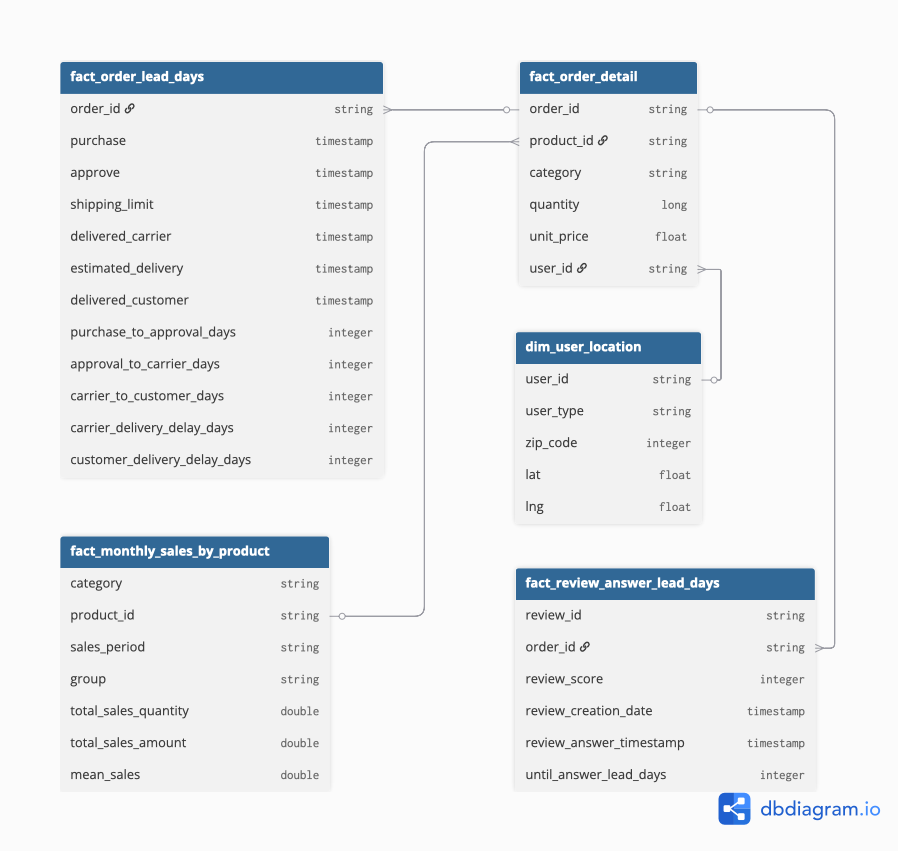
_gold_layer_schema_

    | 테이블 이름 | 설명 |
    |---|---|
    | `fact_order_lead_days` | 주문 단계별 소요 시간(Lead Time) 분석 팩트 테이블 |
    | `fact_order_detail` | 분석용으로 통합된 주문 상세 마스터 테이블 |
    | `dim_user_location` | 사용자 위치 분석을 위한 차원 테이블 |
    | `fact_review_answer_lead_days` | 리뷰 작성 후 답변까지 걸린 시간 분석 팩트 테이블 |
    | `fact_monthly_sales_by_product` | 상품별 월간 판매량 및 매출 집계 테이블 |

## 구현 상세

### CDC (Change Data Capture)

#### 이벤트 기반 데이터 발행 로직

- 상태 의존 데이터

    - append-only 형태의 주문 상태 변경 이벤트가 발생하면, 해당 상태와 연관된 마스터 데이터들을 선별하여 Kafka로 발행합니다.

- 독립 데이터
    - `review` 데이터는 주문 상태 변경 프로세스와 독립적인 생명주기를 가집니다.
    - 따라서 상태 트리거 방식 대신, 시간 윈도우(Time Window) 방식을 적용하여 직전 이벤트와 현재 이벤트 시점 사이에 생성된 리뷰를 취합해 발행했습니다.

- 주문 상태별 발행되는 데이터를 정리하면 다음과 같습니다.

    |주문 상태 값| 의미 | 발행 대상 (Topics) |
    |---|---|---|
    |`purchase`| 결제 완료 | `order_status`( == 'purchase')<br>`payment`<br>`order_item`<br>`product`<br>`seller`<br>`customer`<br>`geolocation` |
    |`approved`| 판매자 승인 완료 | `order_status`( == 'approved')<br>`estimated_delivery_date` |
    |`delivered_carrier`| 배송사 전달 완료 | `order_status`( == 'delivered_carrier') |
    |`delivered_customer` | 고객 배송 완료 | `order_status`( == 'delivered_customer') |
    |N/A (Time Window)| - |`review` |

- 이를 통해 단일 트랜잭션이 여러 Topic으로 전파되는 과정을 Pandas로 [구현](https://www.google.com/search?q=https://github.com/jmhwang-dev/e-commerce/blob/develop/simulator/run.py%23L22)했습니다.

    ```python
    # 주문 상태에 따른 토픽 발행 분기 로직 일부
    if status == 'purchase':
        payment_log = PaymentBronzeProducer.select(order_status_series, ['order_id'])
        mock_payment_log = PandasProducer.calc_mock_ingest_time(payment_log)
        PaymentBronzeProducer.publish(mock_payment_log)
        ...
    ```

#### Schema Management (Confluent Schema Registry)
- CDC sink에서 데이터 정합성을 보장하기 위해 도입했습니다.
- 필수 값이 아닌 필드에 대해 Avro Union Type(`["null", "type"]`)을 적용하여, 소스 데이터의 결측이 발생해도 파이프라인이 중단되지 않도록 **스키마 호환성**을 고려해 설계했습니다.
- 메시지 발행 시, Schema Registry에 등록한 [Avro schema](https://github.com/jmhwang-dev/e-commerce/tree/develop/infra/confluent/schemas)를 통해 [직렬화](https://github.com/jmhwang-dev/e-commerce/blob/develop/src/service/producer/base/pandas.py)를 수행합니다.

    ```jsonc
    // null 포함 스키마 예시: `customer.avsc`

    {   
        "namespace": "bronze",
        "type": "record",
        "name": "customer",
        "fields": [
            { "name": "zip_code", "type": ["null", "int"], "default": null },
            {
                "name": "ingest_time",
                "type": [ "null", { "type": "long", "logicalType": "timestamp-millis" } ],
                "default": null
            }
        ]
    }
    ```

#### Kafka Cluster Configuration
- 단일 노드 장애에 대비하고 안정적인 리더 선출을 보장하기 위해 최소 권장 사양인 3-Node Cluster로 구성했습니다.
- ZooKeeper 의존성을 제거하고 메타데이터 관리 성능을 높이기 위해 최신 KRaft(Kafka Raft Metadata) 모드를 적용했습니다.
- 데이터 주입 시, 개발 및 운영 상황을 고려해서 동일 네트워크 및 외부 클라이언트가 주입할 수 있도록 [advertised.listeners](https://github.com/jmhwang-dev/e-commerce/blob/develop/configs/kafka/server1.properties)를 구성하였습니다.
- 파티션 개수는 가용 코어 수를 고려하여, 단일 파티션으로 구성하였습니다.
    - 총 토픽 개수 = 총 15개 (Bronze Topic 9개 + Silver Topic 6개)
- 가용 자원이 scale out 될 수 있는 상황을 고려하여, 파티션 수를 조절할 수 있도록 구현하였습니다.
    ```python
    def create_topics(admin_client: AdminClient, topics_names_to_create: Iterable[str], num_partitions:int = 1, replication_factor:int = 2):
        """
        Asynchronously creates topics. The call returns a dict of futures.
        We wait for each future to finish to check for errors.
        """
        new_topics = [NewTopic(topic, num_partitions=num_partitions, replication_factor=replication_factor) for topic in topics_names_to_create]
        
        # create_topics는 토픽 이름과 Future 객체를 담은 딕셔너리를 반환합니다.
        fs = admin_client.create_topics(new_topics)

        # 각 토픽의 Future 결과를 기다리며 성공/실패를 확인합니다.
        for topic, f in fs.items():
            try:
                # f.result()를 호출하면 작업이 완료될 때까지 기다립니다.
                # 성공하면 아무것도 반환하지 않습니다.
                f.result()
                print(f"Created topic: {topic}")
            except KafkaException as e:
                # f.result()에서 예외가 발생한 경우입니다.
                # 에러 코드를 확인하여 이미 존재하는 토픽인지 확인합니다.
                if e.args[0].code() == KafkaError.TOPIC_ALREADY_EXISTS:
                    print(f"Topic {topic} already exists, skipping creation.")
                else:
                    # 그 외 다른 카프카 에러
                    print(f"Failed to create topic {topic}: {e}")
    ```

### Ingestion Layer

#### 리소스 최적화 전략

- 초기에는 각 토픽별로 개별적인 스트리밍 쿼리를 실행하도록 설계했습니다.
- 그러나 클러스터의 가용 코어 수 부족으로 인해 모든 쿼리를 동시에 안정적으로 유지하기 어려운 한계가 있었습니다.
- 이로 인해, 개별 쿼리 실행 방식 대신, 토픽을 논리적 그룹으로 묶어 `foreachBatch`를 활용하는 방식으로 구조를 변경했습니다.

  - 이를 통해 단일 스트리밍 쿼리 내에서 여러 토픽의 데이터를 처리하고 Iceberg 테이블로 Sink함으로써, 컨텍스트 스위칭 오버헤드를 줄이고 제한된 자원을 효율적으로 사용했습니다.

#### 실행 모드의 유연성

- 개발 상황에 따라 [개별 스트리밍 모드와 배치(foreachBatch) 모드를 유연하게 전환할 수 있도록 구현](https://github.com/jmhwang-dev/e-commerce/blob/develop/jobs/cdc.py)했습니다.
    ```
    # 필요시 주석
    load_cdc_stream(spark_session, CDC_OPTIONS, logger)
    load_cdc_batch(spark_session, CDC_OPTIONS)
    ```

### Speed Layer

- 배치 처리와 스트림 처리를 모두 지원하는 통합 프레임워크로서 [Spark](https://github.com/jmhwang-dev/e-commerce/blob/develop/configs/spark/spark-defaults.conf)를 선택했습니다.

  - 주문 상태는 총 4개로 구분할 수 있습니다.

      - `purchase`: 구매자가 결제한 시간
      - `approve`: 판매자가 해당 주문을 배송하기 위해 승인한 시간
      - `delivered_carrier`: 주문 상품이 배송사에 도착한 시간
      - `delivered_customer`: 주문 상품이 구매자에게 도착한 시간

- 배송 지연 시뮬레이션을 위해, 각 주문 상태의 리드타임을 갱신하는 [custom state](https://github.com/jmhwang-dev/e-commerce/blob/639b4cc1ff8888dda35b8da56dcb4f85daefb284/src/service/pipeline/stream/gold.py#L63-L150)를 구현하였습니다.

- 각 주문 상태의 리드타임은 최종 리드타임이 계산되기 전까지 다음과 같이 계산됩니다.

    - 최종 리드타임 값이 존재한다면, 누적 리드타임 계산에서 제외
    - 최종 리드타임 값이 없는 경우, 1초 타임 아웃을 기준으로 `mock_lead_time` 누적
        ```python
        mock_lead_time = 7200 # seconds            
        ...
        if dst_state_dict[subtrahend] is not None and dst_state_dict[minuend] is None:
            dst_state_dict[state_name] += mock_lead_time  # 1시간 추가 (초 단위)
        ```

### Batch Layer

#### Iceberg 기반 스냅샷 증분 처리

- 데이터가 누적될수록 전체 데이터를 Full Load하는 방식은 배치 처리 시간이 선형적으로 늘어나는 문제가 있습니다.

- 이를 해결하고자, 테이블의 변경분만 처리하는 [Snapshot ID 기반의 증분 처리 로직](https://github.com/jmhwang-dev/e-commerce/blob/639b4cc1ff8888dda35b8da56dcb4f85daefb284/src/service/utils/iceberg.py#L55-L86)을 다음과 같이 구현했습니다.
    
    - Spark가 Iceberg 메타데이터를 조회하여, 마지막 처리 시점과 현재 최신 시점을 비교해 처리 범위를 산정
    
    - Airflow의 재실행이나 Backfill 시에도 Snapshot을 기준으로 태스크가 실행되므로, 데이터 처리의 일관성을 보장

    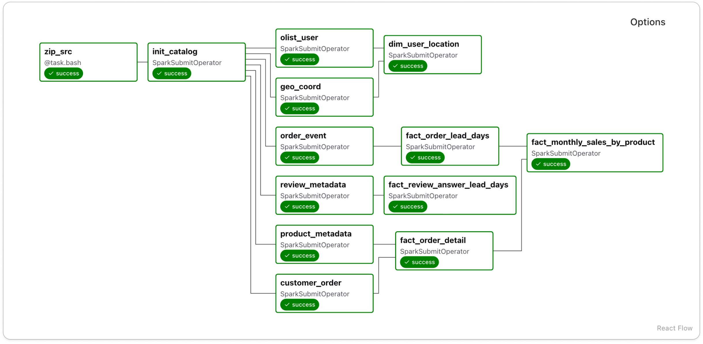
    _dag diagram_

    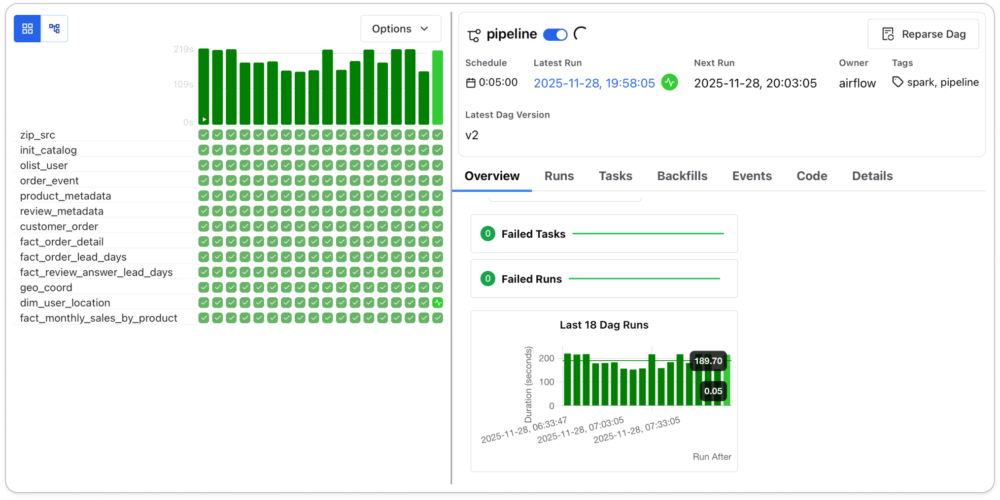
    _gantt chart_

### Serving Layer & Monitoring

#### 비즈니스 및 실시간 배송지연 대시보드

- Superset을 활용하여 **매출 집계** 및 **실시간 배송지연 모니터링**을 확인할 수 있도록 인터랙티브하게 구성했습니다.
- Multi-Tenant 상황을 가정하여, 쿼리에 특화된 Spark Thrift Server를 사용하였습니다.
- 대시보드의 구성은 아래와 같습니다.
    - **Sales Detail**
        

        - Rank by Category: 상품군 별 누적 매출 순위
        - Rank by Product: 상품 별 누적 매출 순위
        - Sales Quantity by Month: 월 별 판매 상품 개수
        - Sales by Month: 월 별 매출 (상품군별, 상품별 확인 가능)
        - Review Distribution: 매출 기준 4개 그룹의 리뷰 점수 분포
        - Average Order Lead Days by Month: 월별 평균 배송 단계 소요 시간

    - **Delivery Monitor**
        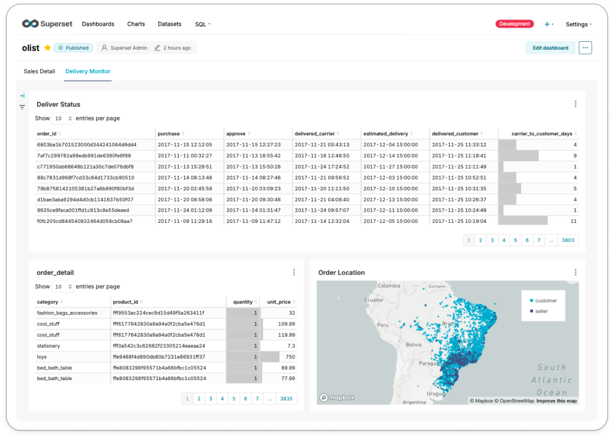

        - Delivery Status: 주문 상태별 타임스탬프와 배송사의 배송 소요일
        - Order Detail: 주문 상세 (카테고리, 상품, 수량, 단가)
        - Order Location: 주문 상품의 판매자와 구매자의 위치

#### 실시간 스트림 모니터링
- 실시간 스트림 관련 모니터링을 위해 Prometheus로 메트릭을 수집하였습니다.
- Grafana를 사용하여 메트릭을 시각화하였습니다. 결과는 다음과 같습니다.
    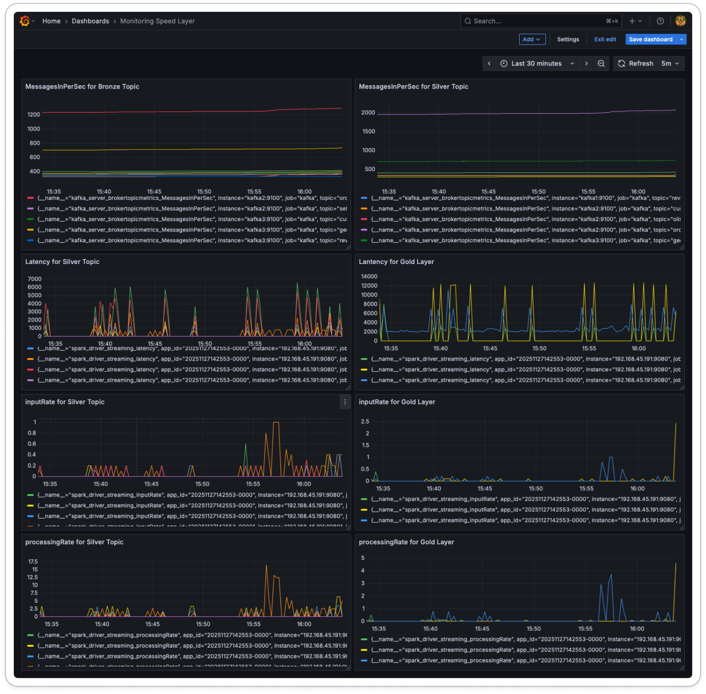

## 결론 및 성과

### 기술적 성과

- **저비용 고효율 아키텍처**

    - 제한된 하드웨어 자원(Mini PC, Desktop)을 역할별로 물리적 분리
    - 온프레미스 환경에서 엔터프라이즈급 Lambda 아키텍처 구현

- **파이프라인 최적화**

    - Iceberg 스냅샷 기반의 증분 처리(Incremental Processing) 도입
    - 배치 처리 시 불필요한 I/O를 획기적으로 줄이고 네트워크 병목 현상 해결

- **데이터 정합성 보장**

    - Airflow 재실행에 의존하지 않고, 데이터 자체의 형상(Snapshot)을 추적
    - 멱등성(Idempotency)이 보장된 견고한 파이프라인 구축

### 비즈니스 기대 효과

- **데이터 기반 의사결정 지원**

    - 자체 개발한 ‘상품 포트폴리오 매트릭스’를 활용
    - 운영자가 수익 기여도가 높은 핵심 상품의 배송 이슈를 우선 파악 가능한 환경 제공

- **운영 리스크 선제 대응**

    - 실시간 대시보드를 통해 배송 지연 징후를 조기에 포착
    - 고객 컴플레인 및 이탈률을 감소시킬 수 있는 모니터링 체계 마련

## 향후 계획

- **인프라 확장성 및 고가용성(HA) 확보**

    - Docker Compose 기반의 단일 환경을 Kubernetes(K8s) 클러스터로 마이그레이션
    - 오토스케일링(HPA) 및 자가 치유(Self-healing) 메커니즘을 도입하여 운영 안정성 강화

- **데이터 품질 관리 자동화**

    - Great Expectations와 같은 검증 도구를 데이터 파이프라인(Ingestion/Processing) 단계에 통합
    - 스키마 불일치나 이상치(Outlier) 발생 시 파이프라인을 조기 차단하여 데이터 신뢰성 확보

- **CI/CD 파이프라인 구축**

    - GitHub Actions를 활용하여 코드 변경 사항에 대한 자동 테스트 및 배포 프로세스 정립
    - 수동 배포로 인한 휴먼 에러 방지 및 개발 생산성 증대