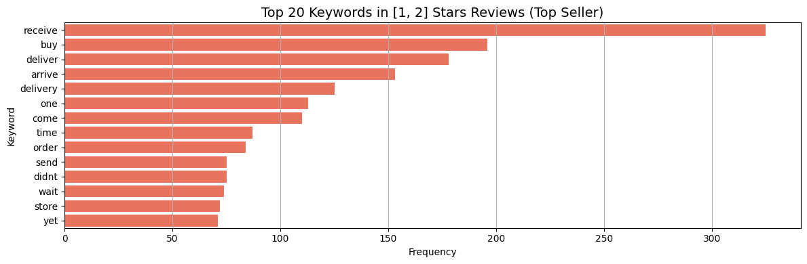
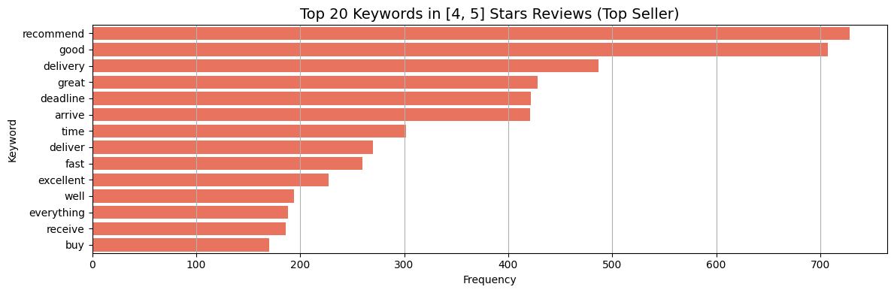
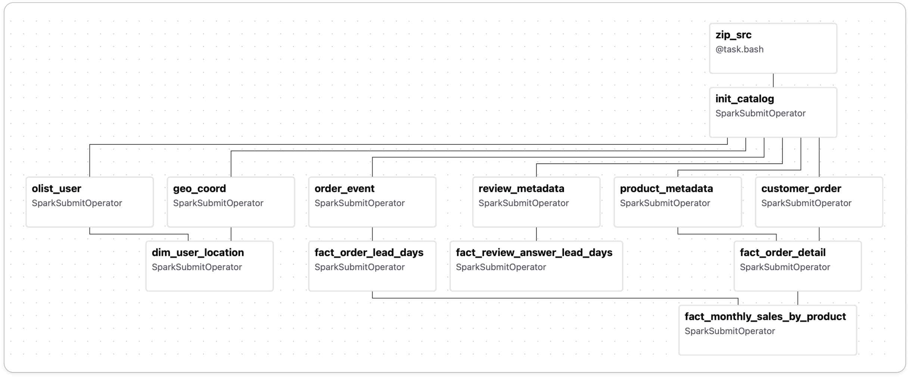

## 프로젝트 개요

1. 프로젝트 기간: 2025년 4월 ~

2. 사용 기술: kafka, confluent, spark, iceberg, minio, airflow, prometheus, grafana, superset

3. 사용 데이터
- 캐글: [Brazilian E-Commerce Public Dataset by Olist](https://www.kaggle.com/datasets/olistbr/brazilian-ecommerce/data)
    - 브라질 소상공인들에게 온라인 마켓플레이스를 제공하는 전자상거래 플랫폼인 `Olist`에서 제공

<!--
## 프로젝트 목표
-  실시간 배송 지연 모니터링 및 매출 대시보드 구축

### 가상의 비즈니스 목표 설정
- `Olist`의 주요 수익원은 판매자로부터 발생하는 수수료입니다.
- 즉, 판매자가 매출이 높을수록 `Olist`의 수익도 증가하는 구조입니다.
- 일반적인 비즈니스 목표인 `매출 증대`를 가상의 주제로 설정하고, EDA를 수행했습니다.

### EDA
- `매출 증대의 원인`을 파악하기 위해 상품을 기준으로 EDA를 수행했습니다.

#### 매출 기반 상품 포트폴리오 분석
- 파레토 법칙으로 확인한 제품군들의 매출을 좀 더 세부적으로 파악하는 게 필요하다고 생각했습니다.
- 그래서 분기별 매출를 기반으로 제품 군을 좀 더 세부적으로 나누어 매출 증대에 기여하는 특정 제품들의 세그먼트를 설정하였습니다.
- 구체적으로 평균 판매액과 주문 수를 기준으로 상품군을 **Star Products, Niche Gems, Volume Drivers, Question Marks**로 구분했습니다.

#### 매출 비대칭의 원인 분석
- `가장 많이 팔리는 제품 카테고리에서 왜 모든 제품이 잘 팔리지는 않을까?` 라는 질문으로 자연스럽게 이어졌습니다.
- 그 원인은 거래 트랜잭션이 아닌 후행 지표인 리뷰에 있다고 생각했고 여기서 원인을 찾아보기로 했습니다.
- 고객 리뷰 분석 결과, 평점 1-2점의 부정 리뷰에서 **배송 지연**이 주요 키워드로 나타났습니다.

_low_rate_review_
- 평점 4-5점의 긍정 리뷰에서는 관련 언급이 적음을 워드클라우드를 통해 확인하였습니다.

_high_rate_review_
- 위 결과를 통해 **배송 문제**가 핵심 상품의 매출 성장을 저해하는 주요 원인 중 하나임을 도출하였습니다.
-->


## 데이터 준비

### CDC (Change Data Capture)
- 원본 데이터의 RDBMS 구조를 아래와 같은 이유로 스키마를 재설계 했습니다.
    - 시계열성이 없음: 레코드가 덮어쓰여지는 경우가 존재하여 변경 이력을 추적할 수 없는 경우가 존재
    
- 이를 위해 원본 데이터를 [전처리](https://github.com/jmhwang-dev/e-commerce/tree/develop/scripts/olist_redefined)하여 스트리밍을 모방했습니다. 내용은 아래와 같습니다.
    - 원본 데이터 스키마의 무결성에 위배되는 중복 레코드 통합 및 불필요한 열 삭제
    - 원본 데이터 스키마에서 비효율을 개선한 최소한의 스키마 변경
- 생성된 `tsv` 파일의 이름은 총 9개로, CDC에서 아래 요소들을 정의할 때 사용됩니다.
    - `Bronze Layer`의 테이블 이름
    - `Bronze Topic`의 토픽 이름
- `테이블 변경 전 후` 변경 내용과 `CDC에 사용할 데이터의 최종 스키마`를 도식화하면 아래와 같습니다.


_테이블 변경 전 후_


_CDC에 사용할 데이터의 최종 스키마_

### 데이터 주입 시간 추가
- 스트림 데이터를 모방하기 위해 `current_ingest_time` 열을 추가하여 데이터 주입 시간을 관리합니다.
- 원래는 메시지 소비 시점에 `current_ingest_time`을 추가해야 합니다.
- 그러나 개발 편의성을 위해 메시지 발행 단계에서 주입 시간을 추가하도록 [PandasProducer](https://github.com/jmhwang-dev/e-commerce/blob/develop/src/service/producer/base/pandas.py) 클래스를 구현했습니다.
- `current_ingest_time`은 아래와 같이 계산합니다.
```python
"""current_ingest_time 계산"""
current_ingest_time = \
    `order_status.tsv`의 이벤트 발생 시간 + \
    pd.Timedelta(f"{50 + np.random.rand() * 50}ms") # 임의의 네트워크 지연 시간: [50ms, 100ms)
```
- 이 때, `FK`로 연결된 모든 레코드에도 직전 계산된 `current_ingest_time`에 지연시간을 추가하여 레코드의 시계열성을 보장합니다.

### 메시지 발행 간격 설정
- 메시지 발행시, 이전 이벤트와 현재 이벤트 간 시간 간격을 두어 메시지를 발행하도록 했습니다.
- 메시지 발행 간격을 효율적으로 mocking 하기 위해 아래와 같이 발행 간격을 설정하였습니다.
<!-- [base_interval](https://github.com/jmhwang-dev/e-commerce/blob/develop/simulator/run.py -->

    ```python
    """transaction replay: mock real-time transaction"""
    
    base_interval = 0  # seconds
    order_status_df = OrderStatusBronzeProducer.get_df()
    past_event_timestamp = pd.to_datetime("2016-09-04 21:15:19.000000")   # first timestamp in order_status

    for i, order_status_series in order_status_df.iterrows():
        current_event_timestamp = order_status_series['timestamp']
        event_term = current_event_timestamp - past_event_timestamp

        # 실제 이벤트 간 시간 차이 간격이 너무 큰 경우 `base_interval` 만큼 간격을 두어 메시지를 발행
        if event_term > pd.Timedelta(seconds=base_interval):
            time.sleep(base_interval)
        else:
            time.sleep(event_term.total_seconds())
    ```


---


## 파이프라인 구조
<!-- - 프로젝트 목표로부터 아키텍처의 기본 요구사항을 아래와 같이 설정할 수 있었습니다.
    1. 배송지연 모니터링을 위한 주문 상태 시간의 스트림 처리 필요
    2. BCG Matrix를 계산하기 위한 `평균 판매액`과 `주문 수` 집계 필요

- 요구사항을 기반으로 아래와 같이 아키텍처를 설계하였습니다. -->


_Lambda Architecture_

### Ingestion Layer

#### Confluent Schema Registry
- CDC로 원천 데이터의 정합성을 보장하기 위해 도입했습니다.
- 원천 데이터는 누락이 없이 수집되어야 하므로 [메시지에 null 값이 포함돼도 발행되도록 스키마를 구성](https://github.com/jmhwang-dev/e-commerce/tree/develop/infra/confluent/schemas/bronze)하였습니다.
- 메시지 발행 시, schema registry에 등록한 Avro schema를 통해 직렬화를 수행합니다.

<!-- 
- 키 추가 내용
- 코드 스니펫?
-->

#### Kafka cluster
- 프로젝트 목표 중 `실시간 배송 지연 모니터링` 달성을 위해 Kafka를 사용했습니다.
- Kafka cluster는 최소 3개의 노드로 구성해야 장애 대응에 안정적이므로 3개의 노드로 구성했습니다.
- 전통적으로 많이 사용되던 메타데이터 관리 방식인 ZooKeeper가 deprecated 될 예정이었으므로, KRaft 모드로 구성했습니다.
<!-- - 단일 파티션에서는 모든 메시지가 한 파티션에 저장되므로, 메시지의 순서가 보장됩니다.
- 파티션 개수는 메시지의 시간 순서를 보장하고 구현을 단순화하기 위해 단일 파티션으로 구성하였습니다. -->
- 데이터 주입 시, 개발 및 운영을 상황을 고려해서 동일 네트워크 및 외부 클라이언트가 주입할 수 있도록 [advertised.listeners](https://github.com/jmhwang-dev/e-commerce/blob/develop/configs/kafka/server1.properties)를 구성하였습니다.

### Speed Layer

#### Spark Streaming
- 배치 처리와 스트림 처리를 모두 지원하는 통합 프레임워크로서 Spark를 선택했습니다.
- Spark 클러스터를 구축하여 대용량 데이터 처리의 성능과 확장성을 확보했습니다.
- 구성은 클라이언트 노드, 마스터 노드, 워커 노드로 각각 하나의 컨테이너로 배포하였습니다.<br>(ETL 클러스터의 [구체적인 리소스](https://github.com/jmhwang-dev/e-commerce/blob/develop/configs/spark/spark-defaults.conf))

### Batch Layer
#### Spark Batch & Airflow


_dag diagram_
<!-- ### Airflow -->

### Storage (MinIO)


_medallion architecture_

#### Iceberg
- 테이블 형식은 Iceberg을 선정하였고 이유는 다음과 같습니다.
    - 스키마와 파티션의 자유로운 변경: 현재는 CDC 데이터의 스키마가 고정되어 있지만, 추후 스키마가 변경될 수 있는 가능성을 내재하고 있음
    - ACID 트랜잭션 보장:  여러 데이터 작업이 동시에 테이블에 접근하더라도 데이터 정합성이 깨지지 않으며, 커밋(Commit)이 완료된 작업만 사용자에게 보여주어 데이터의 신뢰도를 보장
    - 다양한 엔진과의 호환성 및 개방성: 엔진에 종속되지 않는 개방형 표준을 지향
    - 시간 여행과 버전 롤백: 특정 시점의 스냅샷 ID나 타임스탬프를 지정하여 과거의 데이터를 조회 가능하고, 데이터 처리 작업에 오류가 발생했을 경우, 이전의 특정 스냅샷으로 되돌릴 수 있어 데이터 안정성을 크게 높여줌

- 데이터 저장소로 MinIO를 사용하였습니다.
    - 비용과 보안 이슈에 상대적으로 자유로운 on-premise 상황을 가정했습니다.
    - 추후 클라우드로 이전할 수 있는 상황을 고려하여 s3 object storage의 api와 동일한 MinIO를 채택하였습니다.
- MinIO에 저장되는 데이터는 Medallion Layer 구조를 기반으로 데이터 처리와 목적에 따라 Bronze, Silver, Gold 레이어로 분류하여 적재합니다.


<!-- #### Bronze 레이어

| 테이블 이름                | 설명                              |
|----------------------------|-----------------------------------|
| `order_item`               | 주문 품목 정보 저장              |
| `order_status`             | 주문 상태 및 타임스탬프 저장     |
| `estimated_delivery_date`  | 예상 배송일 저장                 |
| `product`                  | 제품 정보 저장                   |
| `payment`                  | 결제 정보 저장                   |
| `customer`                 | 고객 정보 저장                   |
| `geolocation`              | 위치 정보 저장                   |
| `seller`                   | 판매자 정보 저장                 |
| `review`                   | 리뷰 정보 저장                   |

#### Silver 레이어

| 테이블 이름                    | 설명                              |
|--------------------------------|-----------------------------------|
| `order_product`               | 주문과 제품을 조인한 결과            |
| `delivered_order_product`     | 배송 완료된 제품 정보         |
| `user_location`               | 고객/판매자 위치 정보 통합       |
| `delivered_order_timestamp`   | 배송 완료 주문의 통합 시간 기록   |
| `order_timestamp`             | 주문 상태 별 시간 기록          |

#### Gold 레이어

| 테이블 이름                        | 설명                              |
|------------------------------------|-----------------------------------|
| `timestamp_stats_wide`            | 배송 리드타임 통계                |
| `sale_stats`                      | 제품별 매출 집계                 |
| `health_beauty_sales_stats_bcg`   | Health & Beauty 매출 및 BCG 세그먼트 |
| `delivered_order_product_bcg`     | 배송 완료 제품에 BCG 세그먼트 추가 |
| `order_location`                  | 주문의 고객/판매자 위치 정보     |
| `review_metadata_product`        | Health & Beauty 리뷰 정보         | -->

### Serving Layer
#### Thrift Server

#### Superset
- Superset을 활용하여 `매출 집계` 및 `실시간 배송지연 모니터링`을 확인할 수 있도록 인터랙티브하게 구성했습니다.
    - `Sales Detail`
        - Rank by Category: 제품군 별 누적 매출 순위
        - Rank by Product: 제품 별 누적 매출 순위
        - Sales Quantity by Month: 월 별 판매 제품 개수
        - Sales by Month: 월 별 매출 (제품군별, 제품별 확인 가능)
        - Review Distribution: 매출 기준 4개 그룹의 리뷰 점수 분포
        - Average Order Lead Days by Month: 월별 평균 배송 단계 소요 시간

    - `Delivery Monitor`
        - Delivery Status: 주문 상태별 타임스탬프와 배송사의 배송 소요일
        - Order Detail: 주문 상세 (카테고리, 제품, 수량, 단가)
        - Order Location: 주문 제품의 판매자와 구매자의 위치

## 결과


